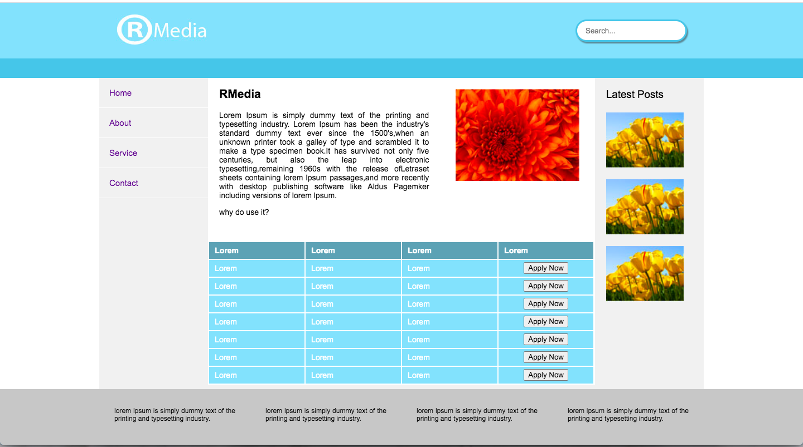
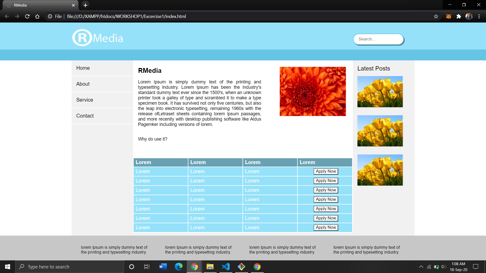
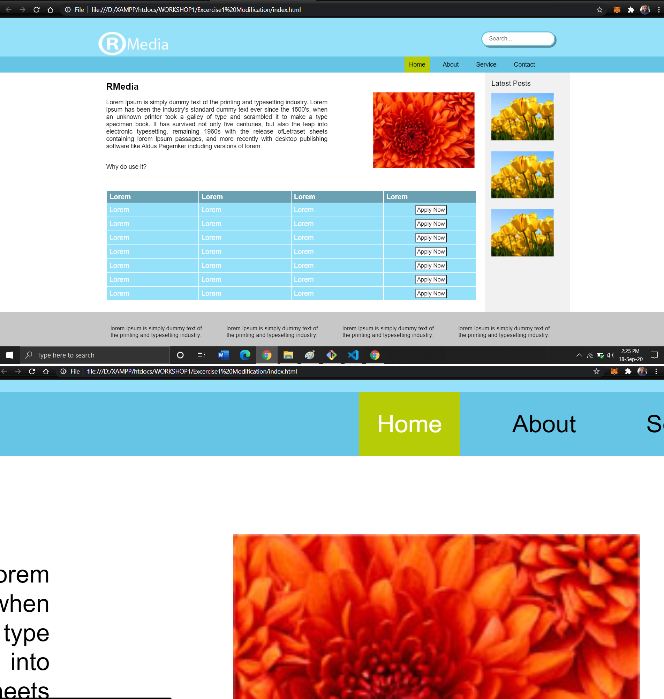
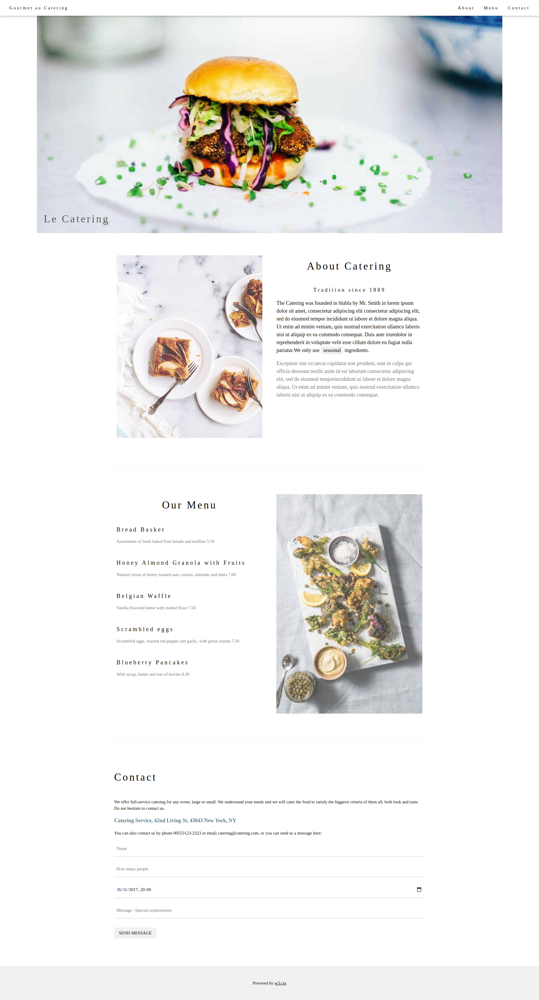

# Website-Creations
Creating websites for a given design and specifications 

Directory structure for each exercise:
>- index.html : Website Page
>- style.css : Styling for index.html  
>- images: Folder containing dependencies required  
>- Design and Specifications: Folder contains properties to be applied and Target design  
>- Outputs: Screenshots of developed website

### Project 1: Simple One-Page Website using HTML5 and CSS

Exercise1 Design:

Output:

Exercise1 Modification contains modified features of Exercise1 such as: horizontal navigation with hover feature, CSS comments and shorthands etc.

Output:

### Project 2: Simple One-Page Website using HTML5 and CSS
Design:

Output: (Last updated: 21-Sep-2020, Monday): https://drive.google.com/file/d/1DvBWzm8jM3Kw9ol-9G5qbz5Zp8zdT-7Z/view?usp=sharing

